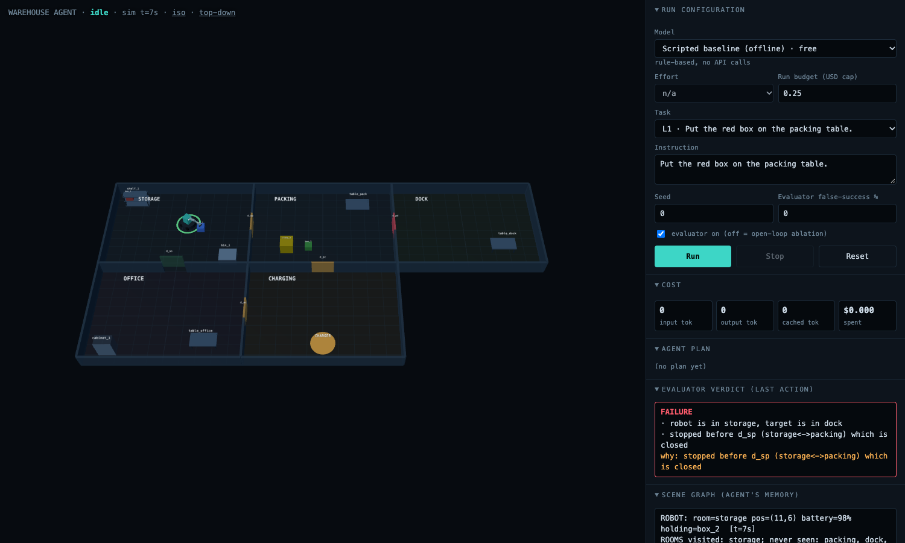

# Embodied Agent Harness

A small, runnable **agent harness for a mobile manipulation robot**, with a 3D simulator, an
evaluator, a persistent scene graph, and a cost-controlled eval runner. A language model (Claude or
OpenAI) controls one robot in a simulated warehouse: it moves between rooms, opens doors and
containers, picks things up, and delivers them, while the harness handles the parts that make
physical agents hard.



The design follows the argument of *Towards the Harness of Embodied Agents*
(Wang et al., "Thea", arXiv 2608.11246): what an embodied agent achieves depends on the harness
around the model, and the physical world withholds two things software gives for free, which are
**reading the state of the world** and **judging the outcome of an action**. This repo is my own small
implementation of those two ideas plus measurement around them. It is not their code.

## What is in the harness

| Piece | Where | What it does |
|---|---|---|
| Agent loop | `scout/warehouse/agent.py` | One tool call per turn, scene-graph brief refreshed every turn, plan checklist |
| Tools as contracts | `scout/warehouse/embodiment.py` | Descriptions state preconditions, reliability, and what to try on failure |
| Evaluator ("exit codes") | `scout/warehouse/evaluator.py` | Post-hook after every physical skill. **Reasoning-blind**: sees only the call, the post-condition, and before/after observations. Returns status, evidence, failure reason. Optional noise model |
| Scene graph | `scout/warehouse/scene_graph.py` | Persistent object memory with staleness and MISSING tracking. Updated by perception, and by action outcomes **only when the evaluator confirms them** |
| Skill backends | `scout/warehouse/backends.py` | Scripted (instant) or **VLA-like policy**: timed episodes, no done signal, judged online by the evaluator at segment boundaries, with early stop on a stall |
| Ground-truth world | `scout/warehouse/world.py` | Rooms, locked doors, containers, fragile and heavy objects, battery. Skills return only `executed`, with no success signal (like a VLA policy) |
| Providers | `scout/warehouse/planners.py` | Claude (Messages API) and OpenAI (Responses API) behind one interface, with usage and cost tracking |
| Evals | `scout/warehouse/evals.py` | Tasks x configs x seeds, judged on ground truth, resumable, hard spend caps |
| 3D console | `web/warehouse.html`, `scout/warehouse/server.py` | Three.js viewer, model picker, live plan, verdicts, scene graph, cost meter |

**How it works:** see [docs/DESIGN.md](docs/DESIGN.md) for the architecture, information boundaries,
design decisions, and known limitations.

## Quick start

```bash
python3 -m venv .venv && .venv/bin/pip install -r requirements.txt
.venv/bin/python -m pytest -q                       # 46 tests, no network, no keys

.venv/bin/uvicorn scout.warehouse.server:app --port 8001
# open http://localhost:8001
```

The default model in the UI is a free rule-based baseline, so the console works without any API key.
To use real models, export the key(s) in the shell that starts the server:

```bash
export ANTHROPIC_API_KEY=...     # Claude models
export OPENAI_API_KEY=...        # OpenAI models
```

Things to try in the console (pick a model, choose "custom instruction"):

- `Put the red box on the packing table.` basic loop and recovery from a failed placement
- `Deliver the green box to the dock table.` locked door, so the agent must find the keycard first
- `Bring the wrench to the office table.` the wrench is hidden in a closed bin (search)
- `Move the yellow crate to the dock table.` 8 kg against a 5 kg limit, so a good agent asks the user
- Set **evaluator false-success %** to 50, or untick **evaluator on**, to see how the agent copes with bad or missing verdicts

## Running evals cheaply

```bash
python -m scout.warehouse.evals                                         # free scripted baseline
python -m scout.warehouse.evals --model claude-sonnet-5-5 --dry-run     # cost estimate, runs nothing
python -m scout.warehouse.evals --model gpt-5.4-mini --seeds 2 --yes    # real run
python -m scout.warehouse.evals --backend policy                        # VLA-like skills (add --no-early-stop to compare)
```

- Paid models need `--yes`; `--dry-run` prints the estimate first.
- `--budget-usd` caps total spend and `--run-budget` aborts any single run.
- Results append to `runs/evals/<model>.jsonl`; re-running skips finished runs.
- Token usage and cost are logged per run. Prices live in `scout/warehouse/models.py`
  (override or add models in an untracked `models.local.json`).

## Deploying (Render)

`render.yaml` is a Blueprint for a single web service. In Render: **New > Blueprint**, pick this repo
(grant Render access to it if it is private), and fill in the API keys, or leave them blank for a
free-baseline-only demo. Then open `https://<service>.onrender.com/?token=<DEMO_TOKEN>`; Render generates
the token, and you can read it on the service's Environment tab.

Because anyone with the URL could otherwise spend your API credit, the server has guards, all set by
environment variables (unset means open, which is what you want locally):

| Variable | Effect |
|---|---|
| `DEMO_TOKEN` | Page and WebSocket both require `?token=...`; `/health` stays open for Render |
| `MAX_RUN_BUDGET_USD` | Ceiling on any single run; the UI's budget field cannot exceed it |
| `MAX_TOTAL_SPEND_USD` | Once this process has spent that much, paid models are refused until restart |

Notes: the free plan sleeps when idle (first request takes a while to wake it), keeps state in memory
(restarting resets the spend counter), and all visitors share one simulated world, so use it for demos,
not concurrent users. The deploy config is untested on Render itself; it was validated locally only.

## Honest status and limitations

- **Tested live:** the OpenAI path on `gpt-5.4-mini` (L1 task, a cent per run). The Claude path is unit-tested
  against a fake client but has not yet been run against the live API in this repo.
- **The baseline's 100% is not evidence about models.** It is a rule-based planner that reads the same
  scene graph and verdicts; it shows the tasks are solvable and the plumbing works.
- **Evaluator noise barely hurts the baseline**, because perception refreshes the scene graph every turn
  and repairs wrong verdicts. Whether model-backed agents trust bad verdicts more is what the evals are for.
- **The evaluator here has ground truth.** In a real robot the evaluator is a perception system (the paper
  uses a VLM judge, about 93% accurate), which is the hard part. Here it is exact, with an injectable error rate.
- OpenAI prices in the registry came from third-party trackers and are marked unverified.
- Playback speed in the UI is adjustable; model thinking time is not scaled by it.

## Layout

```
scout/warehouse/   world, scene graph, evaluator, tools, agent loop, planners, evals, server
web/warehouse.html 3D console
scout/sim, scout/harness, scout/server.py, web/index.html
                   an earlier multi-robot fleet demo (kept for reference, not developed further)
tests/             unit and integration tests (fake provider clients, no network)
```
