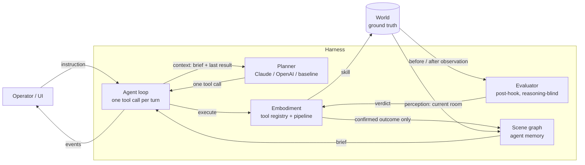
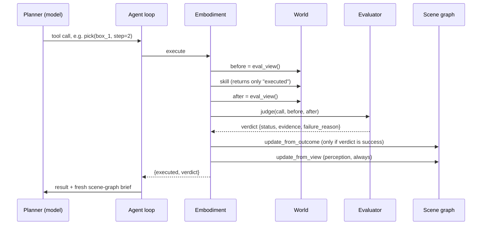

# Design of the agentic system

This document describes how the system works **as built**: what each component does, what information
flows where, and why it is shaped this way. Where something is simulated, simplified, or untested, it
says so. For setup and usage see the [README](../README.md).

## 1. The problem and the idea

A language model controls one mobile manipulator in a simulated warehouse, given an instruction like
*"Deliver the green box to the dock table."* Doing that reliably is a harness problem more than a model
problem, because the physical world withholds two things software gives for free:

1. **Readability.** There is no file system to `grep`. The robot sees only its current room, so the
   agent needs a persistent memory of the world it can reason over.
2. **Verifiability.** There is no exit code. A grasp can close on nothing and the controller will still
   say "done". Someone has to judge the outcome and say *why* it failed.

The design follows *Towards the Harness of Embodied Agents* (Thea, arXiv 2608.11246), which proposes
a **scene graph as context** and **evaluation as exit codes**. This repo is an independent small
implementation of those ideas plus measurement (cost caps, ablation switches, evals). It is not their code.

## 2. Architecture

| Layer | Files | Responsibility |
|---|---|---|
| Skill backends | `scout/warehouse/backends.py` | How physical skills run: scripted (instant) or a VLA-like timed policy supervised online by the evaluator |
| World (ground truth) | `scout/warehouse/world.py` | Rooms, doors, containers, objects, robot, battery, stochastic failures. The agent never reads it directly |
| Embodiment | `scout/warehouse/embodiment.py` | The tool registry and the execution pipeline: skill, then evaluator, then gated scene-graph update |
| Evaluator | `scout/warehouse/evaluator.py` | Judges every physical action against its post-condition and explains failures |
| Scene graph | `scout/warehouse/scene_graph.py` | The agent's persistent, symbolic memory; renders the "brief" shown to the model |
| Agent loop | `scout/warehouse/agent.py` | Runs one task turn by turn; emits events; owns the plan checklist hook |
| Planners | `scout/warehouse/planners.py`, `agent.py` | Claude, OpenAI, and a rule-based baseline behind one interface; usage and cost metering |
| Server and UI | `scout/warehouse/server.py`, `web/warehouse.html` | Streams state, animates it in 3D, hosts the config panel; access and spend guards |
| Evals and models | `scout/warehouse/evals.py`, `models.py`, `tasks.py` | Task suite, model registry and prices, resumable spend-capped runner |

## 3. The agent loop

`run_task` (in `agent.py`) is deliberately small. Each **turn**:

1. Build the context: the current scene-graph **brief** and the result of the previous tool call.
2. Ask the planner for the next step. It returns *(text, one tool call)* or *(text, nothing)*.
3. No tool call means the task is over: the text is the final report.
4. Otherwise execute the call through the embodiment, log it to the trace (including ground truth and
   the brief, for later analysis), and emit events for the UI. Then repeat.

Properties worth knowing:

- **One tool call per turn.** Physical outcomes are hard to predict, so the agent observes the result
  before deciding the next step. The Claude planner sets `disable_parallel_tool_use`, and the OpenAI
  planner sets `parallel_tool_calls=False`; if a model returns several calls anyway, extras get a
  "skipped" result so the API contract stays valid.
- **Bounded.** `max_turns` defaults to 60 (per-task overrides), and every model call is metered against
  a per-run dollar cap that aborts the run.
- **Everything is a tool.** Navigation, manipulation, perception (`look`), asking the human
  (`query_user`) and planning (`update_plan`) are all entries in one flat registry. The loop has no
  special cases for any of them.

### The tool set

| Tool | Kind | Notes |
|---|---|---|
| `navigate_to(target)` | physical | Target is a room, object, container or door. Stops 1.2 m short of entities. Stops in front of the first closed or locked door on the route |
| `open(target)` | physical | Doors and containers; a locked door opens only if the robot holds its key object |
| `pick(object)` | physical | Needs reach (2 m), empty gripper, object not in a closed container, under 5 kg; slips about 1 time in 4 |
| `place(object, target)` | physical | Onto an open container, or the floor of the current room; fragile objects can be dropped and broken |
| `charge()` | physical | Only at the charger in the charging room |
| `look()` | perception | Refreshes the scene graph from the current room |
| `query_user(question)` | interaction | Currently answered by a canned reply (see limitations) |
| `update_plan(steps)` | bookkeeping | Free; shown to the operator, not to the world |

**Tools are contracts.** Each description states preconditions, the reliability of the underlying
skill, and what to try on failure (for example the grasp description says it can fail about 1 in 4 and
to retry, possibly after repositioning). Every physical tool also takes an optional `step`, the
1-based plan step the action serves; see section 8.

## 4. One physical turn, step by step

The key points are in the middle:

- The skill's return value says only `executed: true`. It carries **no success information**, like a
  VLA policy that has no "done" signal.
- The **verdict** is the only thing that tells the agent whether the world changed as intended.
- The scene graph is edited by the outcome **only on a confirmed success**, then always refreshed
  from perception.
- Hard errors (an unknown object ref, bad arguments) are rejected up front as `{ok: false, error}` with
  no physical effect. They are mistakes in the call, not physical failures.

## 5. Information boundaries

Who can see what is the most important design property, so it is worth stating plainly.

| | Agent (model) | Evaluator | Scene graph |
|---|---|---|---|
| Instruction | yes | no | no |
| Its own reasoning | yes | **no** | no |
| Ground-truth world state | **no** | yes (simulated sensors) | no |
| Current-room perception | via `look` and the brief | n/a | yes |
| Tool call and before/after observations | result only | yes | outcome only |
| Verdicts | yes | produces them | gates updates |

- The agent sees the instruction, the brief, and tool results including the verdict. It does not see
  ground truth. The harness keeps ground truth in an internal field (`_truth_ok`) that is stripped
  before the result reaches the model, and logs it to the trace for evaluation.
- The evaluator is **reasoning-blind**: its inputs are the tool call, its per-tool post-condition, and
  the before/after observations. A model grading its own work is an unreliable judge, so the judge never
  sees the model's thoughts or self-report.

## 6. Components in detail

### 6.1 World (`world.py`)

- **Layout:** five rooms (storage, packing, dock, office, charging) on a floor plan 60 m by 28 m, with five
  doors. The packing-to-dock door is locked and needs `keycard_5`, which sits in a closed office cabinet.
- **Contents:** a shelf, a closed bin, a closed cabinet, three tables, and seven objects (boxes, a
  heavy crate, a fragile vase, a keycard, a wrench). The wrench and vase start inside the closed bin.
- **Physics-lite:** 2 m/s travel, battery cost per metre, a 2 m reach, a 5 kg payload limit, a one-object
  gripper.
- **Uncertainty:** grasps slip with probability 0.25; placing a fragile object onto a container drops and
  breaks it with probability 0.3. Both are seeded, so a run is reproducible.
- **Change in the world:** a task can schedule *perturbations*, for example a human moving the red box
  after the third action (task L6).
- **Two views:** `view()` is the robot's own perception (current room only, nothing inside closed
  containers). `eval_view()` is full ground truth, used only by the evaluator and the harness.

### 6.2 Evaluator (`evaluator.py`)

Runs after every physical skill (`navigate_to`, `open`, `pick`, `place`, `charge`). Each tool has a
post-condition (for example "the gripper holds the object") and a diagnosis path for failure, which
returns a concrete reason: *"stopped before d_pd which is locked"*, *"robot is too far from table_pack
(reach is 2.0m)"*, *"grasp slipped"*, *"the vase was dropped and is broken"*. The evaluator **explains**;
it never recommends a fix. Recovery is the agent's job, because only the agent holds the full context.

In this simulation the evaluator has exact ground truth. To avoid pretending that judging is easy,
`judge()` wraps the exact check with a noise model: `false_success_rate` turns real failures into
reported successes (the error shape reported for VLM judges) and `false_failure_rate` does the reverse.
Both are controls in the UI and eval runner.

### 6.3 Scene graph (`scene_graph.py`)

A symbolic memory: object nodes (ref, color, kind, last known room and position, container, last-seen
time, missing and held flags), container and door states, the robot's pose, battery and holding state,
and the set of rooms visited. It is updated two ways:

- **Observation-derived** (`update_from_view`): everything the robot sees in the current room is
  upserted. An object remembered in this room but not visible, and not plausibly inside a closed
  container, is marked **MISSING**. If an object believed held is seen out in the world, the belief is
  corrected.
- **Execution-derived** (`update_from_outcome`): a confirmed pick marks the robot as holding the object,
  a confirmed open marks a container open, and so on. **Only a confirmed success can edit the graph**, so a
  wrong verdict corrupts it. That is what makes evaluator accuracy measurable.

`brief()` renders the graph as compact text for the model each turn: robot state, visited and
never-seen rooms, doors, containers, and every object with its age. Entries older than 60 s are tagged
**STALE**; vanished ones are tagged **MISSING**.

### 6.4 Planners (`planners.py`, `agent.py`)

| Planner | API | Notes |
|---|---|---|
| `ClaudePlanner` | Messages API | Tool use, prompt caching (top-level `cache_control`), optional `effort` setting, 4096 output-token cap |
| `OpenAIPlanner` | Responses API | State chained with `previous_response_id`, so reasoning items persist server-side and each turn sends only the new tool output. Chat Completions was rejected for function tools with `reasoning_effort` |
| `BaselinePlanner` | none | A deterministic, goal-directed rule agent that reads the same brief and verdicts. A reference for solvability, not a language model |

Shared behavior:

- **Append-only history.** Earlier turns are never rewritten. Editing history would invalidate the prompt
  cache from that point every turn (and invalidates thinking blocks on models that bind them).
- **Context shape.** A static system prompt; a first message of *instruction plus brief*; then each tool
  result is returned together with the **latest brief**. Old briefs therefore accumulate in the history,
  which is cheap when caching works and is the simplest correct choice.
- **Metering.** Each planner accumulates input, output, cache-read and cache-write tokens, converts them
  to dollars using the model registry, and raises `BudgetExceeded` past a per-run cap.

### 6.5 Models and cost (`models.py`)

A registry of models with provider, price, supported effort levels and a `verified` flag. Prices for
Claude models come from Anthropic's published table. OpenAI IDs were checked against the account's model
list, but their prices came from third-party sources and are marked unverified. Unknown models are
reported as "price n/a" instead of guessed. Local overrides go in an untracked `models.local.json`.

## 7. Server and UI

- `server.py` runs **one task at a time** and streams events over a WebSocket: `hello` (models, tasks,
  world snapshot, run state), `started`, `task`, `thought`, `tool`, `plan`, `scene`, `done`, `result`,
  `error`, `stopped`.
- **Pacing is server-side.** After each physical action the server sleeps for its simulated duration
  divided by the chosen playback speed (default 2x, 1x is real time), so the 3D animation keeps up even
  with the instant baseline. Model thinking time is not scaled.
- The 3D view shows ground truth. The side panels show the agent's side: plan, last verdict, scene-graph
  brief, token and dollar meters.
- **Guards** (all optional environment variables, unset means open for local use): `DEMO_TOKEN` gates the
  page and socket, `MAX_RUN_BUDGET_USD` clamps the per-run cap the UI can request, and
  `MAX_TOTAL_SPEND_USD` refuses paid runs once the process has spent that much.
- A viewer that joins mid-run is told a task is running, so its Run and Stop buttons are correct.

## 7b. Skill backends: scripted and VLA-like

Underneath the tools, *how a physical skill actually runs* is pluggable (`scout/warehouse/backends.py`).
The agent loop, evaluator and scene graph are identical for both backends.

| | `ScriptedBackend` (default) | `PolicyBackend` (VLA-like) |
|---|---|---|
| Timing | Instant | A timed episode; action chunks every 0.5 s of simulated time |
| Success signal | Returns `executed` only | Returns nothing; the policy acts until it ends, stalls, or is cut off |
| Failure odds | Fixed probability | Depend on the situation: distance to the object, fragility, weight, preconditions |
| Judged | Once, after the skill | **Online**, by the evaluator at segment boundaries (every 2 s) |
| Covers | everything | `pick`, `place`, `open` (navigation and charging stay scripted, like a classical nav stack) |

**This simulates the interface characteristics of a learned manipulation policy, not its quality.**
The success probabilities (0.80 pick, 0.90 place, 0.95 open, minus penalties) are made up.

An episode is planned up front from the real preconditions, with an outcome the agent and evaluator never
see: `success`, `silent_miss` (the gripper closes on nothing, the arm retracts as if finished, and the
policy stops on its own), `drop` (a fragile object released badly), `stall` (the arm hovers and the
policy never finishes), or `flail` (the preconditions are false, so the motion cannot work). Only
observable state is exposed: arm extension, whether the gripper is closed, and an "effect" value (lift,
release, or how far a door has opened).

**Supervision.** The evaluator gets a per-run `SegmentTracker`. At each boundary it re-checks the
post-condition and infers progress *from observations only*. It answers:

- `success`: the post-condition holds, so stop.
- `in_progress`: progress improved recently, so keep going.
- `failure`: the policy ended without success, or **stalled** (no new best progress for two consecutive
  checks, about 4 s), or exceeded the 24 s step budget.

A stall is cut off early (typically 6 to 8 s in) with a concrete reason such as *"policy stalled near the
object: the arm hovered but the gripper never closed"*, instead of waiting out the budget. The result the
agent sees keeps its shape and gains `duration_s` and `segments`; a timeout adds the step-budget note
to the reason, and an early stop adds evidence saying so. A UI toggle (and `--no-early-stop`) disables
early stopping so the two modes can be compared.

Properties that are tested: a forced-success episode is never wrongly cut off as a stall (150 seeds,
zero false failures), episodes are deterministic per seed and always terminate, an infeasible action is
diagnosed from its preconditions, and the scripted backend's behavior is unchanged.

Not modelled: the evaluator's noise applies to the final verdict, not to the in-flight checks; the robot
is still idle while the language model decides; and there is no real learned policy.

## 8. The plan checklist

`update_plan` records an ordered checklist. Models tend to call it once and never again, so progress
would freeze. Instead, each physical action carries an optional `step`, and the harness advances the
checklist itself: earlier steps become done, the current step is "doing", or **blocked** if its verdict
was a failure. When a run ends normally, in-progress steps are closed and blocked steps stay blocked.
This costs no extra turns. The checklist reflects what the model *claims* each action served, so it can
look slightly loose.

## 9. Evaluation

`evals.py` runs tasks x configs x seeds and judges success against **ground truth**, not against the
agent's report or the evaluator's verdicts.

- **Tasks (`tasks.py`):** L1 single pick-and-place; L2 two objects; L3 a locked door requiring a key;
  L4 a fragile object in a closed bin; L5 search for an item; L6 a human moves the target mid-task; L7 a
  too-heavy object, where the correct behavior is to ask the user (model-only, since the baseline has
  no language understanding).
- **Configs:** evaluator on; judge with 20% or 50% false successes; evaluator off (an open-loop ablation
  in which the agent gets no verdicts).
- **Cost control:** `--dry-run` estimates cost, paid models need `--yes`, `--budget-usd` caps the total,
  `--run-budget` caps a single run, and results append to a JSONL file so reruns skip finished runs.
- **Per-run record:** success, turns, simulated time, token usage, dollars, and counts of true failures,
  false successes and false failures.

## 10. Design decisions and why

| Decision | Reason |
|---|---|
| One tool call per turn | Physical actions have unpredictable outcomes; observing before the next move avoids carrying an invalid sequence forward |
| Skills return no success signal | Models the real situation with learned policies and forces the verdict path to do real work |
| Verdict carries evidence and a failure reason | A bare boolean allows retry but not adaptation: different causes need different recoveries |
| Evaluator is reasoning-blind | Avoids a model grading its own work |
| Graph edited only on confirmed outcomes | Makes the judge's accuracy matter and measurable, instead of letting memory update optimistically |
| Perception refresh every turn | Real systems keep sensing; it also repairs some wrong verdicts (see limitations) |
| Tools as contracts, with failure behavior in the description | Everything that acts must have schema, preconditions and a documented failure mode attached |
| Append-only history | Keeps prompt caching and provider-side reasoning state intact |
| `step` tag instead of plan updates | Gets live progress at no extra turns |
| Baseline planner on the same interface | A reference that shows the tasks are solvable and the plumbing is right |
| Spend caps at three levels (run, total, server) | The point is to experiment cheaply and to be safe if a link leaks |

## 11. How this differs from the Thea paper

Implemented here, following the paper: agent loop and tool registry; scene graph as context with gated
updates; an independent post-hook evaluator that returns status, evidence and failure reason;
`query_user`; active search for missing items; tools described as contracts.

**Not implemented:** a real perception stack and a VLM judge (the world and evaluator here are exact
simulations with injectable error); durable memory and "tool experience" consolidated across tasks;
skills as `SKILL.md` knowledge packages; the embodiment profile; real hardware or multiple embodiments.

**Added here:** an evaluator noise knob, ablation switches, per-run cost caps and resumable evals, a
live 3D console, the `step` progress tag, and the baseline planner as a reference.

## 12. Known limitations

- **The Claude path has not been run against the live API in this repo** (unit-tested with a fake client).
  The OpenAI path has been run live on `gpt-5.4-mini` for the simplest task.
- **The baseline's perfect scores are not evidence about models.** They show the tasks are solvable.
- **Evaluator noise barely affects the baseline**, because the per-turn perception refresh repairs wrong
  verdicts when the object is in view. Whether model agents trust bad verdicts more is open.
- **The evaluator is exact in simulation.** Judging from real sensor data is the hard part this does not
  address.
- **The agent thinks synchronously**: the robot is idle while the model decides. A real-time harness would
  keep executing and be interruptible. The policy backend makes skills take time, but does not remove this.
- **The policy backend is a simulation of a policy's interface, not a policy.** Its odds are invented, and
  in-flight evaluator checks are exact (noise only affects the final verdict).
- **`query_user` answers are canned**, so the human-in-the-loop behavior is not yet interactive.
- **Perception is limited to the current room** and positions are exact, with no sensor noise.
- **No memory across tasks**: every task starts with an empty scene graph.
- One robot, one shared world, one task at a time. The earlier multi-robot fleet demo is kept in the
  repo but not developed further.

## 13. Extending it

- **A new skill:** add `_s_<name>` in `world.py`, a post-condition `_pc_<name>` in `evaluator.py`, an
  entry in `TOOLS` (and in `PHYSICAL`), and an outcome rule in `scene_graph.py`.
- **A new task:** add a `Task` in `tasks.py` with an instruction, a ground-truth success predicate, and
  optionally a perturbation.
- **A new model provider:** implement `start` and `decide` (see `ClaudePlanner`), register models in
  `models.py`, and add a branch in `make_planner`.
- **A different world or a real robot:** the harness depends on three things, a `skill` dispatcher, an
  observation for perception, and an observation for evaluation. Putting those behind an adapter is
  the natural step toward a ROS2-style backend.
